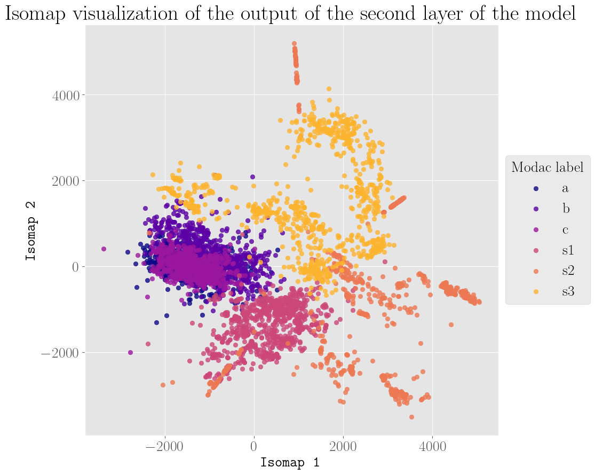

# DATASIM - MODAC

### Projet d'option 2022-2023

#### *Classification de scènes accoustiques robustes à la modalité d'acquisition*

##### Etudiants : *Sacha Bouchez*, *Nessim Kerkeni*
##### Encadrants : *Barbara Pascal*, *Vincent Lostanlen*

---

# Sommaire

1. Introduction
   1.1 Présentation de `dcase`
   1.2 Résultats sur la baseline initiale
   1.3 Apprentissage des représentations
   
2. Exploiter le classifieur existant pour apprendre une représentation fidèle
3. Comportement du classifieur de la baseline initiale
4. Entraînement du réseau
   4.1 Réseaux siamois  (Siamese Networks)

---

### 1. Introduction
#### 1.1 Présentation de `dcase`

- `dcase` : *Detection and Classification of Acoustic Scenes and Events*
- Scène accoustique : *désigne le label de l'endroit où le son a été enregistré, la situation et l'activité humaine impliquée .* [1]

---

### 1. Introduction
#### 1.1 Présentation de `dcase`

- Task 1 de `dcase2022`:
  > The goal of acoustic scene classification is to classify a test recording into one of the predefined ten acoustic scene classes. This targets acoustic scene classification with devices with low computational and memory allowance [...]

---

### 1. Introduction
#### 1.1 Présentation de `dcase`

- Schéma général de la tâche 1 de `dcase2022`
- Source : dcase.community

---

### 1. Introduction
#### 1.1 Présentation de `dcase`

##### Audio Dataset

Tau Urban Acoustic Scenes 2022 caractéristiques :

  - 10 scènes accoustiques différentes de 12 villes européennes.
  - 4 modalités d'acquisition différentes (trois réelles et une synthétique)
  - 64 heures d'audio de 1 seconde chacune

---

### 1. Introduction
#### 1.1 Présentation de `dcase`

##### Computed Features

- Chaque fichier audio est converti en énergies de bande log-mel.
- Chaque énergie de bande log-mel est une image 40 $\times$ 51, c'est l'entrée du réseau de neurones

---

<!-- ### 1. Introduction
#### 1.1 Présentation de `dcase`

##### Computed Features -->

---

### 1. Introduction
#### 1.1 Présentation de `dcase`

##### Classifieur :

- Type : Convolutional Neural Network (CNN)
- Input : 40 $\times$ 51 images (log-mel band energies)
- Output : 10 probabilités (une par classe)

---

| Layer | Output Shape | Param # |
| --- | --- | --- |
| conv2d | (None, 40, 51, 16) | 800 |
| batch_normalization | (None, 40, 51, 16) | 64 |
| activation | (None, 40, 51, 16) | 0 |
| conv2d_1 | (None, 40, 51, 16) | 12560 |
| batch_normalization_1 | (None, 40, 51, 16) | 64 |
| activation_1 | (None, 40, 51, 16) | 0 |
| max_pooling2d | (None, 8, 10, 16) | 0 |
| dropout | (None, 8, 10, 16) | 0 |

---

| Layer | Output Shape | Param # |
| --- | --- | --- |
| conv2d_2 | (None, 8, 10, 32) | 25120 |
| batch_normalization_2 | (None, 8, 10, 32) | 128 |
| activation_2 | (None, 8, 10, 32) | 0 |
| max_pooling2d_1 | (None, 2, 1, 32) | 0 |
| dropout_1 | (None, 2, 1, 32) | 0 |
| flatten | (None, 64) | 0 |
| dense | (None, 100) | 6500 |
| dropout_2 | (None, 100) | 0 |
| dense_1 | (None, 10) | 1010 |

---

### 1. Introduction
#### 1.2 Résultats sur la baseline initiale

<!-- \begin{tabular}{|c||c|c|}
  \hline
  \textbf{Scène} & Logloss & Accuracy \\ \hline
  \texttt{airport} & 1.625 & 36.2\% \\ \hline
  \texttt{bus} & 1.601 & 35.4\% \\ \hline
  \texttt{metro} & 1.520 & 39.4\% \\ \hline
  \texttt{metro\_station} & 1.572 & 44.5\% \\ \hline
  \texttt{park} & 1.437 & 57.7\% \\ \hline
  \texttt{public\_square} & 2.103 & 25.9\% \\ \hline
  \texttt{shopping\_mall} & 1.580 & 44.9\% \\ \hline
  \texttt{street\_pedestrian} & 1.906 & 26.7\% \\ \hline
  \texttt{street\_traffic} & 0.981 & 71.3\% \\ \hline
  \texttt{tram} & 1.435 & 43.8\% \\ \hline \hline
  Overall & \textbf{1.576} & \textbf{42.6\%} \\ \hline
\end{tabular} -->

| Scène | Logloss | Accuracy |
| --- | --- | --- |
| airport | 1.625 | 36.2% |
| metro\_station | 1.572 | 44.5% |
| street\_pedestrian | 1.906 | 26.7% |
| street\_traffic | 0.981 | 71.3% |
| tram | 1.435 | 43.8% |
| Overall | **1.576** | **42.6%** |

---

### 1. Introduction
#### 1.3 Apprentissage des représentations

>*The process of learning a representation of a dataset, such that the representation is meaningful for a given task.*

**Intuition** : Le réseau de neurones apprend une représentation de l'audio qui est indépendante de la modalité d'enregistrement.

**Interest** : La représentation apprise peut être utilisée pour améliorer les performances sur d'autres tâches d'apprentissage.

---

### 2. Exploiter le classifieur existant pour améliorer les performances

On sépare le réseau de neurone de la manière suivante : 

$$
    \Phi_\theta = \varphi_\theta \circ f_\theta
$$

où $\theta$ sont les poids du modèle, $f_\theta$ est la partie du réseau qui extrait les représentations, et $\varphi_\theta$ est le classifieur.

---

### 2. Exploiter le classifieur existant pour améliorer les performances

Le problème s'écrit alors comme suit :

$$
    (\varphi_\theta \circ f_\theta)^* \in \arg\min_{\theta}\ \  \underbrace{\mathcal{L}_{\text{class}}\left((\varphi_\theta \circ f_\theta)(\textbf{x}),\textbf{y}_{\text{scene}}\right)}_{\text{Classification Task}}\quad +\underbrace{\quad \lambda \mathcal{L}_{\text{reg}}\left(f_\theta(\textbf{x}),\textbf{y}_{\text{ref}}\right)}_{\text{Representation Constraint}}
$$

avec $\mathcal{L}_{\text{class}}$ la cross-entropy.

$$
    \mathcal{L}_{\text{class}}(X,y) = \sum_{i=1}^n y_{i}\log(\Phi_\theta(x_i))
$$

---

### 2. Exploiter le classifieur existant pour améliorer les performances

Avec $m_1$ et $m_2$ deux modalités différentes, et $x_{m_1}^i$ et $x_{m_2}^i$ deux exemples de la même classe, où $i$ est l'indice de l'exemple, on espère obtenir :

$$
    \left\|f_\theta(x_{m_1}^i) - f_\theta(x_{m_2}^i) \right\| \approx 0
$$

---

### 2. Exploiter le classifieur existant pour améliorer les performances

Le terme de régularisation est donc :

$$
    \displaystyle \mathcal{L}_{\text{reg}}(X, y) = \sum_{y_i = y_j \atop m_i\neq m_j}\|f_\theta(x_i) - f_\theta(x_j)\|_1
$$

---

### 3. Comportement du classifieur de la baseline initiale

#### 3.1 A la deuxième couche convolutive
#### 3.2 A la troisème couche convolutive
#### 3.3 Etude de la dimensionnalité des clusters dans l'espace latent de la deuxième couche convolutive

---

---

---

---

---

---

---

---

---

### 4. Entraînement du modèle

#### 4.1 Réseaux siamois

---

### References

1. Introduction to acoustic event and scene analysis by Keisuke Imoto
2. A geometrically constrained deep network for CT image segmentation
3. To Reverse The Gradient Or Not: An Empirical Comparison Of Adversarial And Multi-Task Learning In Speech Recognition