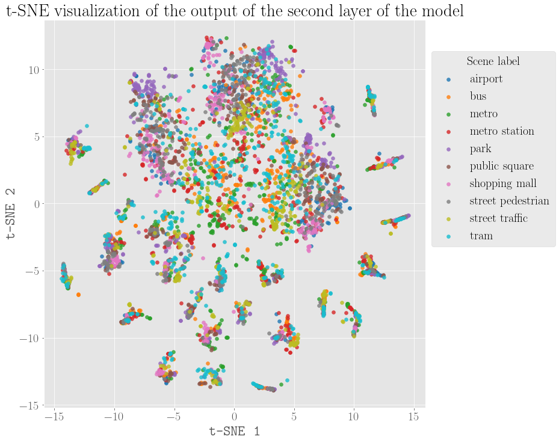
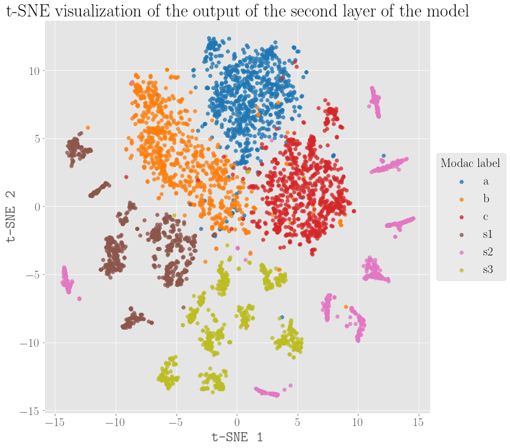
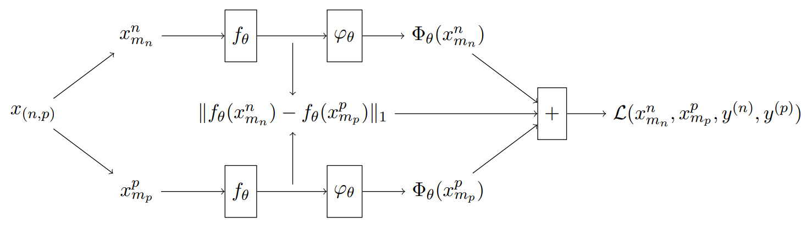

# DATASIM - MODAC

### Projet d'option 2022-2023

##### 29/03/2023

#### *Classification de scènes accoustiques robustes à la modalité d'acquisition*

##### Etudiants : *Sacha Bouchez*, *Nessim Kerkeni*
##### Encadrants : *Barbara Pascal*, *Vincent Lostanlen*

---

# Sommaire

1. Introduction
   1.1 Présentation de `dcase`
   1.2 Résultats sur la baseline initiale
   1.3 Apprentissage des représentations
   
2. Exploiter le classifieur existant pour apprendre une représentation fidèle
3. Comportement du classifieur de la baseline initiale
4. Entraînement du réseau

---

### 1. Introduction
#### 1.1 Présentation de `dcase`

- `dcase` : *Detection and Classification of Acoustic Scenes and Events*
- Scène accoustique : *désigne le label de l'endroit où le son a été enregistré, la situation et l'activité humaine impliquée .* [1]

---

### 1. Introduction
#### 1.1 Présentation de `dcase`

- Task 1 de `dcase2022`:
  > The goal of acoustic scene classification is to classify a test recording into one of the predefined ten acoustic scene classes. This targets acoustic scene classification with devices with low computational and memory allowance [...]

---

### 1. Introduction
#### 1.1 Présentation de `dcase`

- Schéma général de la tâche 1 de `dcase2022`
- Source : dcase.community

---

#### 1.1 Présentation de `dcase`

##### Audio Dataset

Tau Urban Acoustic Scenes 2022 caractéristiques :

  - $N_{\text{scene}} = 10$ scènes accoustiques différentes de 12 villes européennes.
  - 4 modalités d'acquisition différentes.
  - Entraînement : 64h d'audio
  - Validation : 22h d'audio

---

##### Audio Dataset

- $\textbf{Scenes} = \lbrace \texttt{airport, bus, metro, metro\_station, park}$
$\texttt{public\_square, shopping\_mall, street\_pedestrian}$
$\texttt{stree\_traffic, tram}\rbrace$

- **Villes** : Barcelone, Lisbonne, Paris, Stockholm, Vienne, Prague, Lyon, Helsinki, Londres, Milan

- **MODAC** : $\textbf{m} = \lbrace a,b,c,s_1, s_2 , s_3\rbrace$
---

##### Audio Dataset

- MODAC : $\textbf{m} = \lbrace a,b,c,s_j\rbrace$

- $\textbf{X} = \lbrace x_{m_n}^{n} \; , \; n \in \lbrace 1 , \dots, N \rbrace \rbrace$ avec $m_n \in \textbf{m}$ la modac du $n$-ème fichier audio.
- $\textbf{y}  = \lbrace y^{(n)}, n \in \lbrace 1, \dots, N \rbrace \rbrace$ avec $y^{(n)} \in [0,1]^{N_{\text{scene}}}$ le vecteur de probabilités de la classe de $x_{m_n}^{n}$ : $y^{(n)}  = \left[ 0.01, \dots, \underbrace{0.91}_{i}, \dots, 0.01 \right]^T$.
- On notera $c_n$ la classe de $x_{m_n}^{n}$ : $c_n = i \;(= \texttt{metro})$.

---

##### Audio Dataset

| $n$ | Ville | Scène  | MODAC |
| --- | --- | --- | --- |
| $1$ | Stockholm | $\texttt{metro\_station}$ | $a$ |
| $2$ | Lisbonne | $\texttt{street\_traffic}$ | $s_1$ |
| $3$ | Barcelone | $\texttt{airport}$ | $c$ |
| $4$ | Vienne | $\texttt{stree\_pedestrian}$ | $s_3$ |
| $5$ | Londres | $\texttt{metro\_station}$ | $b$ |
| $\;\vdots$ | $\;\;\;\;\;\;\;\;\vdots$ | $\;\;\;\;\;\;\;\;\;\;\;\;\vdots$ |  $\;\;\;\;\;\;\vdots$ |
| $N$ | Paris | $\texttt{public\_square}$ | $s_2$ |

---

##### Audio Dataset

MODAC prises au même moment et au même endroit :

| $n$ | Ville | Scène  | MODAC |
| --- | --- | --- | --- |
| $1$ | Stockholm | $\texttt{metro\_station}$ | $a$ |
| $2$ | Stockholm |$\texttt{metro\_station}$ | $b$ |
| $3$ | Stockholm | $\texttt{metro\_station}$ | $c$ |
| $4, 5, 6$ | Stockholm | $\texttt{metro\_station}$ | $s_j$ |

---

#### 1.1 Présentation de `dcase`

##### Attributs de chaque fichier audio

- Chaque fichier audio est converti en spectrogramme de Mel à 40 bandes.
- Chaque spectrogramme est une image 40 $\times$ 51, c'est l'entrée du réseau de neurones : $\textbf{X} \subset \mathcal{P}( \mathbb{R}^{40 \times 51})$

---

---

### 1. Introduction
#### 1.1 Présentation de `dcase`

##### Classifieur :

- Type : Convolutional Neural Network (CNN).
- Input $\textbf{X}$ : 40 $\times$ 51 spectrogrammes de Mel.
- Output $\hat{\textbf{y}} = \lbrace \hat{y^{(n)}} \;,\; n \in \lbrace 1, \dots, N \rbrace  \rbrace \subset \mathbb{R}^{N_{\text{scene}}}$ : vecteurs de probabilités des classes des $x_{m_n}^{n}$.
<!-- - Activation : $\sigma = \text{softmax}$.
- Prédiction : $\text{pred}(\hat{y^{(n)}}) = \underset{i \in \lbrace 1, \dots, N_{\text{scene}} \rbrace}{\arg \max} \sigma(\hat{y^{(n)}}(i))$ -->

---

| N° | Layer | Output Shape | Param # |
| --- | --- | --- | --- |
| 1 | conv2d | (None, 40, 51, 16) | 800 |
| 2 | batch_normalization | (None, 40, 51, 16) | 64 |
| 3 | activation | (None, 40, 51, 16) | 0 |
| 4 | conv2d_1 | (None, 40, 51, 16) | 12560 |
| 5 | batch_normalization_1 | (None, 40, 51, 16) | 64 |
| 6 | activation_1 | (None, 40, 51, 16) | 0 |
| 7 | max_pooling2d | (None, 8, 10, 16) | 0 |
| 8 | dropout | (None, 8, 10, 16) | 0 |
| 9 | conv2d_2 | (None, 8, 10, 32) | 25120 |

---

| N° | Layer | Output Shape | Param # |
| --- | --- | --- | --- |
| 10 | batch_normalization_2 | (None, 8, 10, 32) | 128 |
| 11 | activation_2 | (None, 8, 10, 32) | 0 |
| 12 | max_pooling2d_1 | (None, 2, 1, 32) | 0 |
| 13 | dropout_1 | (None, 2, 1, 32) | 0 |
| 14 | flatten | (None, 64) | 0 |
| 15 | dense | (None, 100) | 6500 |
| 16 | dropout_2 | (None, 100) | 0 |
| 17 | dense_1 | (None, 10) | 1010 |

---

### 1. Introduction
#### 1.2 Résultats sur la baseline initiale

<!-- \begin{tabular}{|c||c|c|}
  \hline
  \textbf{Scène} & Logloss & Accuracy \\ \hline
  \texttt{airport} & 1.625 & 36.2\% \\ \hline
  \texttt{bus} & 1.601 & 35.4\% \\ \hline
  \texttt{metro} & 1.520 & 39.4\% \\ \hline
  \texttt{metro\_station} & 1.572 & 44.5\% \\ \hline
  \texttt{park} & 1.437 & 57.7\% \\ \hline
  \texttt{public\_square} & 2.103 & 25.9\% \\ \hline
  \texttt{shopping\_mall} & 1.580 & 44.9\% \\ \hline
  \texttt{street\_pedestrian} & 1.906 & 26.7\% \\ \hline
  \texttt{street\_traffic} & 0.981 & 71.3\% \\ \hline
  \texttt{tram} & 1.435 & 43.8\% \\ \hline \hline
  Overall & \textbf{1.576} & \textbf{42.6\%} \\ \hline
\end{tabular} -->

| Scène | Logloss | Accuracy |
| --- | --- | --- |
| airport | 1.625 | 36.2% |
| metro\_station | 1.572 | 44.5% |
| street\_pedestrian | 1.906 | 26.7% |
| street\_traffic | 0.981 | 71.3% |
| tram | 1.435 | 43.8% |
| Overall | **1.576** | **42.6%** |

---

### 1. Introduction
#### 1.3 Apprentissage des représentations

**Intuition** : Le réseau de neurones apprend une représentation de l'audio qui est indépendante de la modalité d'enregistrement.

**Intérêt** : La représentation apprise peut être utilisée pour améliorer les performances sur d'autres tâches d'apprentissage.

---

### 2. Exploiter le classifieur existant pour améliorer les performances

On sépare le réseau de neurone de la manière suivante : 

$$
    \Phi_\theta = \varphi_\theta \circ f_\theta
$$

où $\theta$ sont les poids du modèle, $f_\theta$ est la partie du réseau qui extrait les représentations, et $\varphi_\theta$ est le classifieur.

On écrit donc : 

$$
    \forall n  \in \lbrace 1, \dots, N \rbrace , \; \hat{y^{(n)}} = \varphi_\theta(f_\theta(x_{m_n}^{n}))

$$

---

| N° | Layer | Output Shape | Param # |
| --- | --- | --- | --- |
| 1 | conv2d | (None, 40, 51, 16) | 800 |
| 2 | batch_normalization | (None, 40, 51, 16) | 64 |
| 3 | activation | (None, 40, 51, 16) | 0 |
| 4 | conv2d_1 | (None, 40, 51, 16) | 12560 |
| 5 | batch_normalization_1 | (None, 40, 51, 16) | 64 |
| 6 | activation_1 | (None, 40, 51, 16) | 0 |
| 7 | max_pooling2d | (None, 8, 10, 16) | 0 |
| 8 | dropout | (None, 8, 10, 16) | 0 |

---

### 2. Exploiter le classifieur existant pour améliorer les performances

Le problème s'écrit alors comme suit :

$$
    (\varphi_\theta \circ f_\theta)^* \in \arg\min_{\theta}\ \  \underbrace{\mathcal{L}_{\text{class}}\left((\varphi_\theta \circ f_\theta)(\textbf{X}),\textbf{y}\right)}_{\text{Classification Task}}\quad +\underbrace{\quad \lambda \mathcal{L}_{\text{reg}}\left(f_\theta(\textbf{X})\right)}_{\text{Representation Constraint}}
$$

avec $\mathcal{L}_{\text{class}}$ la cross-entropy.

---

### 2. Exploiter le classifieur existant pour améliorer les performances

- Sortie du modèle : $\hat{y^{(n)}} = \left[ p_1, \dots, p_i, \dots, p_{N_{\text{classes}}} \right]^T$

- Cible du modèle : $y^{(n)} = \left[ 0.01, \dots, 0.91, \dots, 0.01 \right]^T$

On écrit donc :

$$
    \mathcal{L}_{\text{class}}(\textbf{X},\textbf{y}) = -\sum_{n=1}^N \langle y^{(n)} | \log(\Phi_\theta(x_{m_n}^{(n)})) \rangle = -\sum_{n=1}^N \sum_{i=1}^{N_{\text{classes}}} y_i^{(n)} \log(\hat{y_i}^{(n)})
$$

Pour le jeu d'entraînement, on obtient : $\mathcal{L}_{\text{class}}(\textbf{X},\textbf{y}) = 1.14$

---

### 2. Exploiter le classifieur existant pour améliorer les performances

Avec $m_n$ et $m_p$ deux modalités différentes, et $x_{m_n}^n$ et $x_{m_p}^p$ deux exemples de la même classe, où $n$ et $p$ sont les indices des exemples, on espère obtenir :

$$
    \left\|f_\theta(x_{m_n}^n) - f_\theta(x_{m_p}^p) \right\| \approx 0
$$

---

### 2. Exploiter le classifieur existant pour améliorer les performances

Le terme de régularisation est donc :

$$

    \displaystyle \mathcal{L}_{\text{reg}}(x_{m_n}^n, x_{m_p}^p) = \mathbb{1}_{[c_n = c_p, m_n \neq m_p]}(x_{m_n}^n, x_{m_p}^p) \|f_\theta(x_{m_n}^n) - f_\theta(x_{m_p}^p)\|_1

$$

$$

\displaystyle \mathcal{L}_{\text{reg}}(\textbf{X}) = \sum_{1 \leq n,p \leq N \atop c_n = c_p , m_n \neq m_p}\|f_\theta(x_{m_n}^n) - f_\theta(x_{m_p}^p)\|_1
$$

---

### 3. Comportement du classifieur de la baseline initiale

#### 3.1 Analyse sur les deuxième et troisième couches de convolution 2D.
- Outil qualitatif : **t-SNE**.
- Réduction de dimensionnalité.
- Préserve la distance entre les points. (Minimisation d'une divergence de Kullback-Leibler entre les deux distributions de probabilité)

---

---

---

---

---

#### 3.1 Analyse sur les deuxième et troisième couches de convolution 2D.

- **t-SNE** donne une visualisation qualitative des données.
- Les labels de scène semblent mélangés.
- Les modac semblent être bien séparées.

 $\Rightarrow$ Le classifieur sépare les scènes en fonction des modac.
 $\Rightarrow$ Apprentissage d'une représentation dépendante de la modalité d'enregistrement.

---
### 3. Comportement du classifieur de la baseline initiale
#### 3.3 Géométrie des espaces latents

- Connaître le nombre de composantes connexes de l'espace latent.
- $\Rightarrow$ Persistence diagram

---

---

---

### 4. Entraînement du modèle

#### 4.1 Réseau siamois

- Input :  $\displaystyle \left[ \begin{matrix}x_{m_n}^n \\ 
x_{m_p}^p \end{matrix} \right]$ avec $p \neq n$ et $m_n \neq m_p$.

- Poids partagés.

- Output : $\displaystyle \begin{bmatrix}  \hat{y^{(n)}} \\
\hat{y^{(p)}} \end{bmatrix} =  \begin{bmatrix}  \Phi_{\theta}(x_{m_n}^n) \\
\Phi_{\theta}(x_{m_p}^p) \end{bmatrix} = \begin{bmatrix}  (\varphi_\theta \circ f_\theta)(x_{m_n}^n) \\
(\varphi_\theta \circ f_\theta)(x_{m_p}^p) \end{bmatrix}$

---

MODAC prises au même moment et au même endroit :

| $n$ | Ville | Scène  | MODAC |
| --- | --- | --- | --- |
| $1$ | Stockholm | $\texttt{metro\_station}$ | $a$ |
| $2$ | Stockholm |$\texttt{metro\_station}$ | $b$ |
| $3$ | Stockholm | $\texttt{metro\_station}$ | $c$ |
| $4, 5, 6$ | Stockholm | $\texttt{metro\_station}$ | $s_j$ |

---

#### 4.1 Réseau siamois

- $\lbrace (n,p) / 1 \leq n,p \leq N, c_n = c_p , m_n \neq m_p \rbrace$ : ensemble des paires beaucoup trop grand.
- On va considérer les groupes $\left(\textbf{X}_j\right)_{1 \leq j \leq P}$ d'enregistrements pris au même moment et au même endroit pour des modac différentes.
- L'ensemble d'entraînement est donc l'ensemble de paires suivant : 
  
$$

\textbf{X}_{\text{siamois}} = \displaystyle \bigcup_{j = 1}^P \left( \textbf{X}_j \times \textbf{X}_j \right)

$$

---

#### 4.1 Réseau siamois

##### Terme de pénalité :

<!-- $$

\mathcal{L}(x_{m_i}^n, x_{m_j}^n, y^n) = \mathcal{L}_{\text{class}}\left(\Phi_{\theta}(x_{m_i}^n),y\right) + \mathcal{L}_{\text{class}}\left(\Phi_{\theta}(x_{m_j}^n),y\right) + \lambda \mathcal{L}_{\text{reg}}\left(f_\theta(x_{m_i}^n,x_{m_j}^n)\right)

$$ -->
$$

\mathcal{L}(\textbf{X}, \textbf{y}) =  \sum_{x_{m_n}^{n}, x_{m_p}^{p} \in \textbf{X}_{\text{siamois}}} \left[ \mathcal{L_\text{class}}(x_{m_n}^{n}, y^{(n)}) + \mathcal{L_\text{class}}(x_{m_p}^{p}, y^{(p)})+ \lambda \mathcal{L}_{\text{reg}}\left(x_{m_n}^n,x_{m_p}^p\right) \right]

$$

avec $\lambda$ le facteur de régularisation et :
$$

    \displaystyle \mathcal{L}_{\text{reg}}(x_{m_n}^n, x_{m_p}^p) = \mathbb{1}_{c_n = c_p}(x_{m_n}^n, x_{m_p}^p) \|f_\theta(x_{m_n}^n) - f_\theta(x_{m_p}^p)\|_1

$$

$$
\mathcal{L}_{\text{class}}\left(x_{m_n}^n,y^{(n)}\right) = \langle y^{(n)} | \log\left(\Phi_\theta(x_{m_n}^n)\right) \rangle
$$

---

#### 4.1 Réseau siamois

---

#### 4.2 Travail restant

<!-- - Estimer le nombre de paires $card(\lbrace (x_{m_i}^n, x_{m_j}^n) / 1 \leq n \leq N, i \neq j \rbrace)$ -->
- Estimer la quantité $\displaystyle \mathcal{L}_{\text{reg}}(\textbf{X}) = \sum_{x_{m_n}^{n}, x_{m_p}^{p} \in \textbf{X}_{\text{siamois}}}\|f_\theta(x_{m_n}^n) - f_\theta(x_{m_p}^p)\|_1$
- Estimer la quantité $\displaystyle \mathcal{L}(\textbf{X}, \textbf{y}) = \sum_{x_{m_n}^{n}, x_{m_p}^{p} \in \textbf{X}_{\text{siamois}}} \left[ \mathcal{L_\text{class}}(x_{m_n}^n, y^{(n)}) + \mathcal{L_\text{class}}(x_{m_p}^p, y^{(p)})\right]$

$\Rightarrow$ En déduire une valeur de $\lambda$ cohérente pour l'entraînement.

---

### 5. Conclusion

- Classification de fichiers audio dont on soupçonne qu'elle est dépendante de la modac.
- Notre analyse montre que le réseau permet de séparer les modac en fonction des scènes.
- Il est donc cohérent de s'intéresser à la classification d'audio en fonction de la modac.
- Le réseau siamois permet d'obtenir une représentation des données qui permet de séparer les scènes en fonction des modac.

---

### References

1. Introduction to acoustic event and scene analysis by **Keisuke Imoto**
<!-- 2. A geometrically constrained deep network for CT image segmentation
3. To Reverse The Gradient Or Not: An Empirical Comparison Of Adversarial And Multi-Task Learning In Speech Recognition -->
2. Siamese Neural Networks for One-shot Image Recognition, **Gregory Koch**, **Richard Zemel**, **Ruslan Salakhutdinov**.